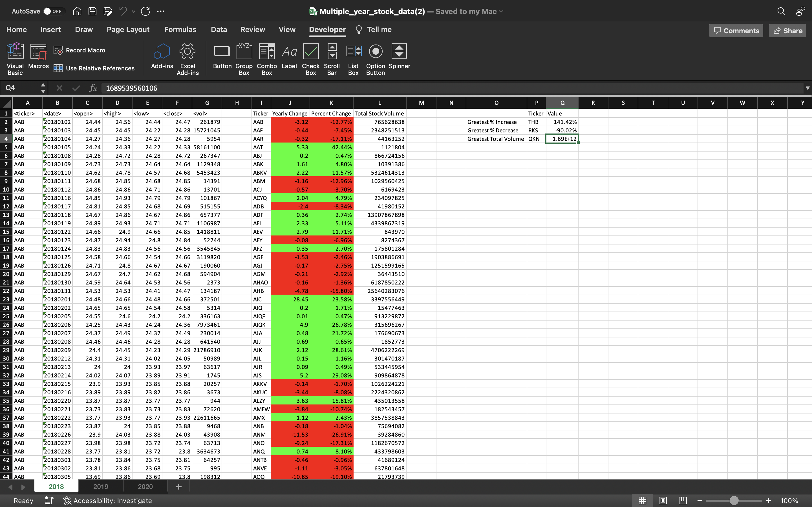
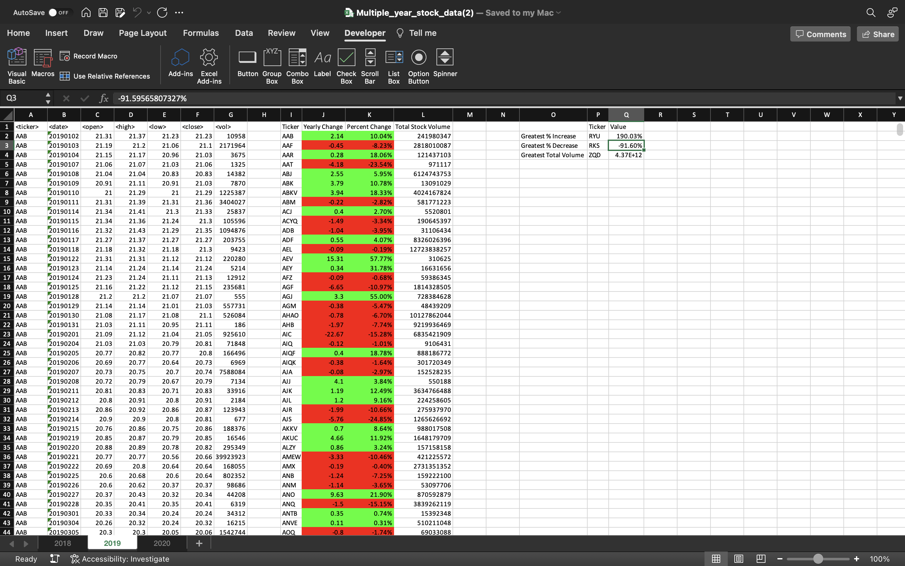
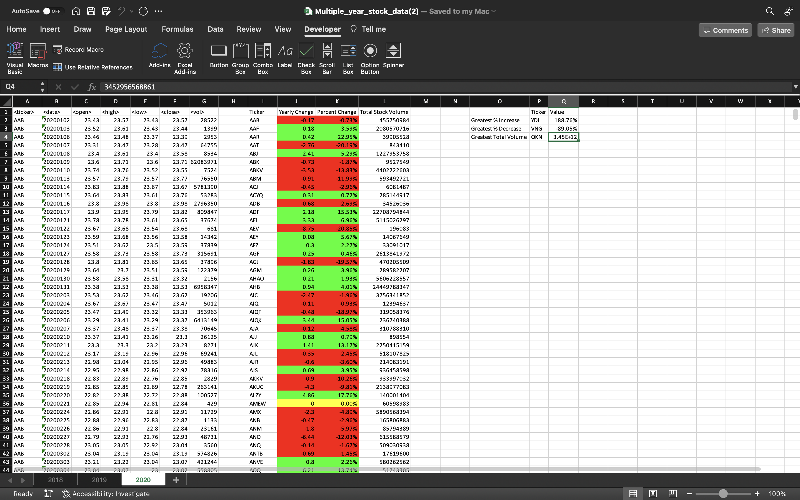

# Multiple Stock Year Data Analysis
## Using VBA scripting to analyze generated stock market data, and highlight results based on values.

  Every part of this project is a sample code which shows how to do the following:

  1- Loops through all stocks for one year on every worksheet and outputs the following information

   - The ticker symbol
   - Yearly change from the opening price at the beginning of a given year to the closing price at the end of that year 
   - The percentage change from the opening price at the beginning of a given year to the closing price at the end of that year 
   - The total stock volume of the stock.

  2- Return the stock with the greatest percentage increase, greatest percentage decrease, and greatest total volume 

  

  

  

